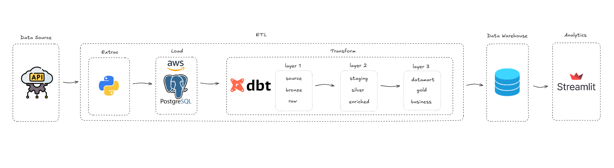

# Criando Data Warehouse do zero - Workshop Jornada de dados

Este projeto tem como objetivo construir um pipeline de dados moderno e modular para ingestão, transformação e visualização de dados, utilizando ferramentas amplamente adotadas no ecossistema de engenharia de dados.

---

## 🧭 Visão Geral

O pipeline segue o fluxo **ETLT** (Extract, Load, Transform, Transform) e está estruturado em cinco etapas principais:

```
Data Source → Extract & Load → Transform → Data Warehouse → Analytics
```

---

## 📌 Arquitetura do Pipeline



---

## 🔧 Tecnologias Utilizadas

| Etapa            | Tecnologia           | Descrição |
|------------------|----------------------|-----------|
| **Fonte de Dados** | `API REST`          | Fonte externa de dados, consumida via requisições HTTP. |
| **Extração**       | `Python`             | Código Python utilizado para consumir a API e preparar os dados. |
| **Carga**          | `PostgreSQL (AWS)`   | Dados brutos são armazenados em um banco relacional hospedado na AWS. |
| **Transformação**  | `dbt`                | Aplicação da modelagem em camadas (bronze, silver, gold) com SQL modular. |
| **Data Warehouse** | `PostgreSQL`         | O repositório final para os dados transformados, pronto para análise. |
| **Análises**       | `Streamlit`          | Interface de visualização interativa dos dados com dashboards em tempo real. |

---

## 🧱 Estrutura de Transformações com dbt

As transformações são organizadas em **3 camadas**:

### 🔹 Layer 1 – Raw / Source / Bronze
- Armazena os dados como foram extraídos da API.
- Nenhuma limpeza ou transformação é feita aqui.

### 🔸 Layer 2 – Staging / Silver / Enriched
- Dados padronizados, tipados e limpos.
- Enriquecimento com joins e regras de negócio intermediárias.

### 🥇 Layer 3 – Gold / Business / Datamart
- Modelos finais prontos para consumo analítico.
- KPIs, métricas e agregações para dashboards.

---

## 🚀 Como Executar o Projeto

### 1. ⚙️ Extração e Carga

```bash
python extract_api_data.py
```
> Realiza a coleta de dados via API e salva no banco PostgreSQL (caso deseje refazer este projeto, você deve criar seu banco e definir suas variáveis de ambiente).

---

### 2. 🧪 Transformações com dbt

```bash
# Inicializa o ambiente dbt
dbt init

# Executa as transformações
dbt run
```

---

### 3. 📊 Visualização com Streamlit

```bash
streamlit run app.py
```
> Acessa o dashboard interativo com os dados transformados.

---

## 🗄️ Pré-requisitos

- Python 3.10+
- PostgreSQL instalado ou acesso a uma instância (ex: AWS RDS)
- dbt Core (`pip install dbt-postgres`)
- Streamlit (`pip install streamlit`)
- Requisitos do projeto:
  ```bash
  pip install -r requirements.txt
  ```

---

## 📁 Organização do Repositório

```
.
├── extract/
│   └── extract_api_data.py
├── dbt/
│   ├── models/
│   │   ├── staging/
│   │   ├── silver/
│   │   └── gold/
│   └── dbt_project.yml
├── streamlit/
│   └── app.py
└── README.md
```

---

## 📈 Benefícios da Arquitetura

✅ Separação clara de responsabilidades  
✅ Modularidade e escalabilidade  
✅ Transformações versionadas com SQL  
✅ Facilidade para testes e debugging  
✅ Visualização acessível e amigável

---

## 📎 Referências

- [dbt Documentation](https://docs.getdbt.com/)
- [Streamlit Documentation](https://docs.streamlit.io/)
- [PostgreSQL](https://www.postgresql.org/)
- [REST API concepts](https://restfulapi.net/)
- [Modern Data Stack](https://moderndatastack.xyz)

---

> 🧠 **Dica:** Esta arquitetura pode ser expandida para orquestração com Airflow e controle de qualidade com ferramentas como Great Expectations.

